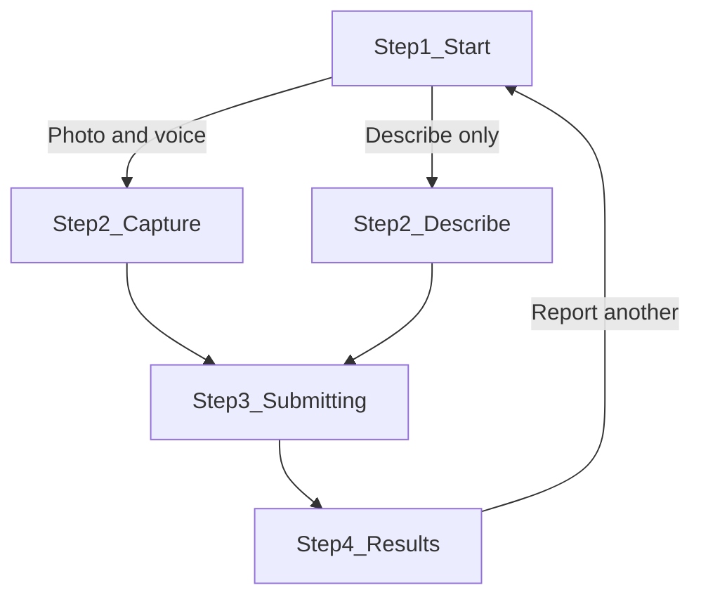

# Victim App Redesign

## Current problems

[`src/pages/VictimApp.tsx`](src/pages/VictimApp.tsx) (~616 lines) packs everything into one screen with overlapping actions:

| Issue | Why it confuses users |
|-------|----------------------|
| **PANIC SNAP + textarea + Quick Report on one screen** | No clear primary path; users don't know if text is required or optional |
| **"Quick Report (Text Only)" looks like a peer option** | It reads as a second equal CTA, not a fallback when camera fails |
| **Raw lat/lng at top** | Not human-friendly; doesn't say "location shared with dispatchers" |
| **Capturing state says "Recording audio..."** | No guidance on what to say or when to tap Stop |
| **Results screen is dispatcher-style** | Severity number, category, threats first — victim needs "help is coming" reassurance |
| **Missing person links on emergency screen** | Dilutes focus during a crisis |
| **No step progress** | User can't tell where they are in the flow |
| **No local emergency call guidance** | Standard crisis-app pattern missing |
| **`reporter_phone` supported by API but not collected** | Dispatchers can't call back |

Hooks ([`useGeolocation`](src/hooks/useGeolocation.ts), [`useMediaCapture`](src/hooks/useMediaCapture.ts)) and [`api.submitEmergency`](src/lib/api.ts) stay unchanged.

---

## Design goals

1. **One obvious action per step** — reduce cognitive load under stress
2. **Plain language** — replace jargon ("PANIC SNAP", "triage") with "Report with photo", "Help is on the way"
3. **Reassurance-first results** — lead with status message, then first aid, then details
4. **Mobile-first** — sticky footer CTAs, large touch targets, scrollable results
5. **Component split** — maintainable `src/components/victim/` folder

---

## New flow (4 steps)



### Step 1 — Start (`VictimStartStep`)
- **Hero message:** "Report an emergency" + one-line subtitle: "We'll alert dispatchers and share your location."
- **Primary CTA:** large red **"Report with Photo & Voice"** (replaces "PANIC SNAP")
- **Secondary:** text link **"Describe emergency without camera"** → switches to describe-only sub-step on same screen (not a competing full-width button)
- **Location pill:** "Location detected" / "Detecting…" / "Location unavailable — you can still report" (hide raw coords; optional tap to open Maps)
- **Safety banner:** "If you're in immediate danger, call your local emergency number first."
- **Footer links:** Missing person report + dashboard (small, de-emphasized)

### Step 2a — Capture (`VictimCaptureStep`)
- Full-width camera preview with captured still
- **Instruction card:** "Describe what you see out loud. Tap below when finished."
- Recording indicator + elapsed timer (optional, simple mm:ss from capture start)
- Sticky bottom: **"Send Report"** (replaces "Stop & Submit")
- Back/cancel returns to Step 1 (stops media, resets capture)

### Step 2b — Describe only (`VictimDescribeStep`)
- Prominent textarea with label: "What is happening?"
- Optional **phone number** input (maps to `reporter_phone` in API)
- Location status pill (same as Step 1)
- Sticky bottom: **"Send Report"**
- Back returns to Step 1

### Step 3 — Submitting (`VictimSubmittingStep`)
- Full-screen overlay (keep blur + spinner)
- Copy: **"Sending your report…"** + **"Stay safe. Help is being notified."**
- Reuse existing analyzing state logic

### Step 4 — Results (`VictimResultsStep`)
Reorder content for victims:

1. **Status hero** — green/amber/red based on severity:
   - "Report received — help is being coordinated"
   - If `severity >= 4` and units dispatched: "Emergency units are being dispatched"
2. **First aid** (if present) — highest visual priority after hero
3. **Your location** — Maps link (keep existing)
4. **Dispatched units** (if any) — simplified cards
5. **Collapsible "Details"** section — severity, category, threats, recommended actions, translation (dispatcher-style data tucked away)
6. **Report Another Emergency** button

Extract shared UI: `TypewriterText`, severity hero, location pill → small shared pieces inside `victim/`.

---

## Component structure

```
src/components/victim/
  VictimStepIndicator.tsx    # dots or "Step 2 of 3" bar
  VictimLocationPill.tsx     # friendly location status + Maps link
  VictimSafetyBanner.tsx     # call local emergency first
  VictimStartStep.tsx
  VictimCaptureStep.tsx
  VictimDescribeStep.tsx
  VictimSubmittingStep.tsx
  VictimResultsStep.tsx
  TypewriterText.tsx         # move from VictimApp
```

[`src/pages/VictimApp.tsx`](src/pages/VictimApp.tsx) becomes a thin orchestrator (~120 lines):
- State: `step: 'start' | 'capture' | 'describe' | 'submitting' | 'results'`
- Wires hooks + `handlePanicSnap`, `handleStopAndSubmit`, `handleQuickReport`, `handleReset`
- Adds `reporterPhone` state passed to describe + capture submit paths
- Renders header + `VictimStepIndicator` + current step component

---

## Copy changes (examples)

| Before | After |
|--------|-------|
| PANIC SNAP | Report with Photo & Voice |
| Quick Report (Text Only) | Describe emergency without camera |
| Stop & Submit | Send Report |
| AI is analyzing your situation... | Sending your report… |
| Severity 4 — High | Report received — help is being coordinated |

---

## Implementation notes

- **No backend changes** — same `api.submitEmergency` payload; add optional `reporter_phone` from new input
- **Preserve fallbacks** — camera denied still routes user to describe-only path with existing error message (rewritten in plain language)
- **Framer Motion** — keep step transitions; use `AnimatePresence` in orchestrator
- **Styling** — reuse existing Tailwind tokens (`glass`, `glow-red`, severity colors) from [`src/index.css`](src/index.css); no theme overhaul
- **Accessibility** — ensure sticky CTAs have safe-area padding (`pb-safe`), buttons have clear labels, safety banner uses semantic emphasis

---

## Verification

1. **Photo path:** Start → capture → describe aloud → Send → results shows hero + first aid
2. **Text path:** Start → describe without camera → fill text → Send → results
3. **Camera denied:** error message + user can use describe path
4. **Location denied:** pill shows warning; submit still works
5. **Reset:** "Report Another Emergency" returns to Step 1
6. `npm run build` passes

---

## Out of scope

- Calling real 911 / tel: links (region-specific; safety banner is text-only unless you want a configurable number later)
- Offline retry queue
- i18n
- Changes to dispatcher dashboard or backend routes
